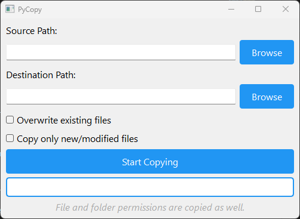

  # PyCopy  
  A simple Python GUI app for copying files and folders while retaining permissions.
  
  ## Get Started  
  - Clone, fork, or download the code.
  - Run this command in your virtual environment:
  
          pip install pyside6
  
  ## Features
      
  #### Easy to use
   - Simple interface
   - No confusing menus or commands to remember
   - Always open source, always free
   - Choose to overwrite existing or not
   - Choose to only copy new or edited files and folders

  #### Cross-platform 
   Use the software on:
   - Linux
   - macOS
   - Windows

  ## License
  - MIT license

  ## Screen shots
  
  
